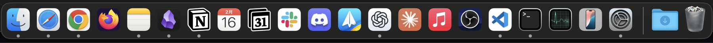

# macOSの設定手順書
macOS Sequoia v15.3.1にて検証済み

## 自動セットアップ
brewを使ったアプリケーションのインストール、CLIでOSの設定をするために、`./setup.sh`を実行する

### Install brew
下記のコマンドを実行し、CLIの出力通りにPATHにbrewを加える。
```sh
$ /bin/bash -c "$(curl -fsSL https://raw.githubusercontent.com/Homebrew/install/HEAD/install.sh)"
```

# ディレクトリの作成
スクリーンショット格納用のディレクトリを作成する
```sh
$ mkdir -p ~/Screenshots
```

# アプリのインストール
`brew_list.txt`, `brewcask_list.txt`に列挙されているアプリをbrewコマンド経由でインストールする

```sh
cat ./brew_list.txt | xargs -I{} brew install {}
cat ./brew_cask_list.txt | xargs -I{} brew install --cask {}
```

# OSのCLIでの設定
下記のコマンドでDock, Finderなどの設定を行う

```sh
$ ./macos_config.sh
```

# Dockの設定をインポートする
Dockのサイズや並び順序の設定が適用される

```sh
plutil -convert binary1 -o ~/dock.plist ~/dock.xml
defaults import com.apple.dock ~/dock.plist
killall Dock
```

現状のdockの並び順



## マニュアルセットアップ
- 自動で設定できない項目に関しては、[manual_config.md](./manual_config.md)を読んで手動で設定する
- dockの並び順の設定は [dock_setting.md](./dock_setting.md)を参照すること
